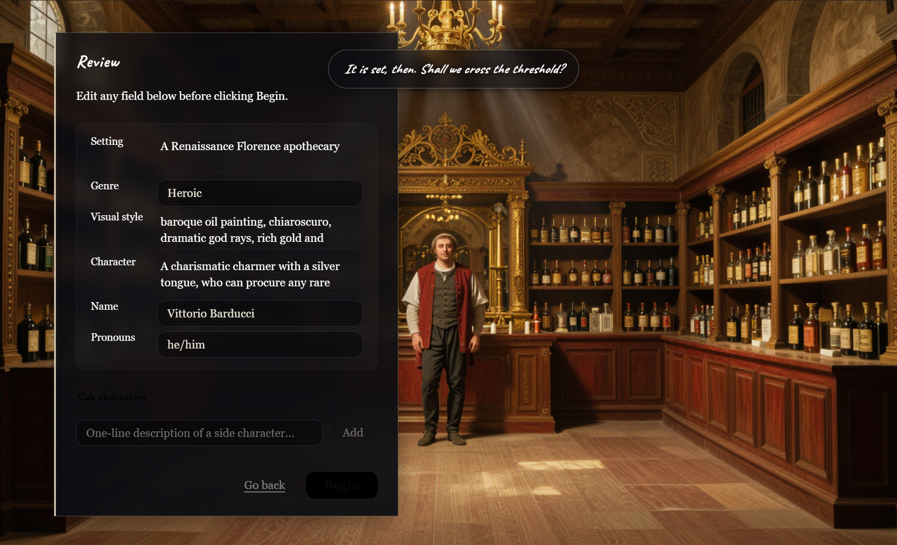
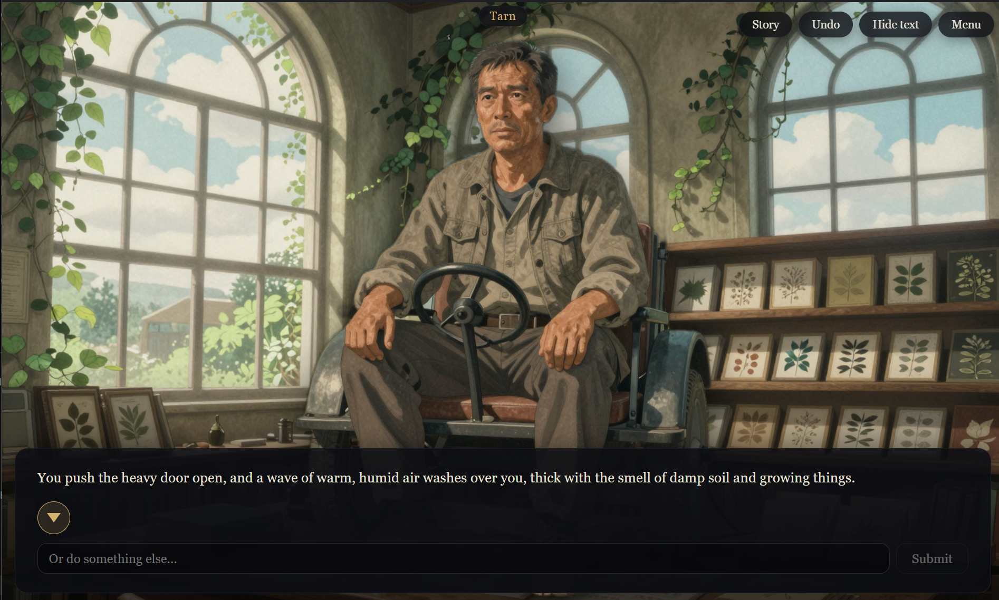
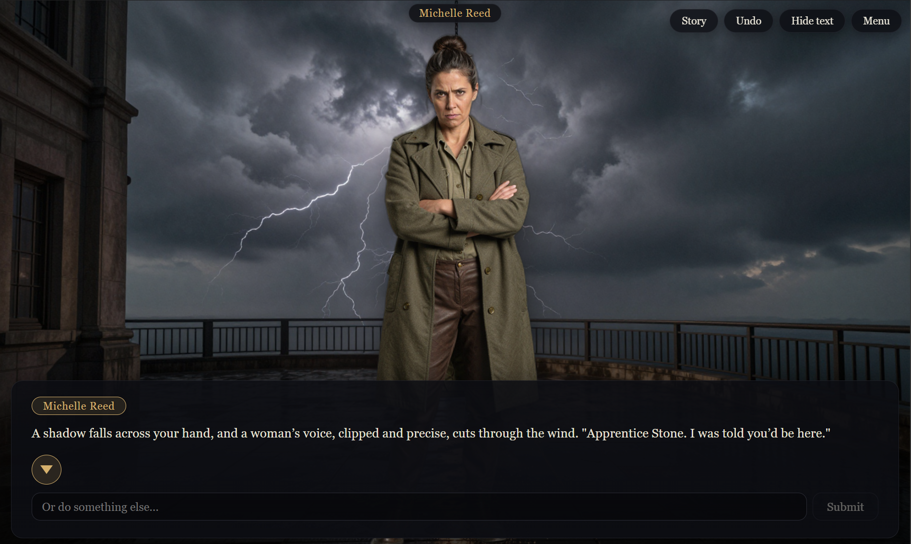
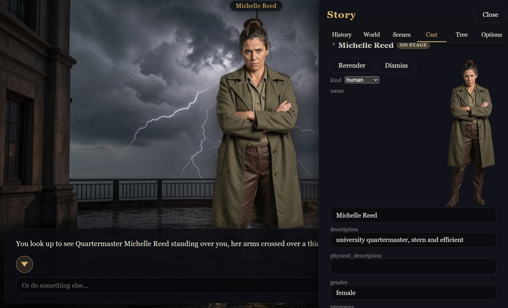

# Lucidium

Lucidium is an infinite AI-driven visual novel that runs on your machine. It combines local image models and cloud-hosted open source LLM's to run easily and privately on most computers with at least 8GB of VRAM.


## Screenshots

<p align="center">
  
</p>

You describe the world you want; Lucidium fills in the rest and lets you edit
every field before it starts.

<p align="center">
  
  
</p>

Characters and backgrounds are generated as the story goes. Alongside the
usual dialog choices there is always an "Or do something else..." box — you
can say or do anything, not just pick from a list.

<p align="center">
  
</p>

The Story panel is the engine's memory, exposed and editable. It tracks a variety of facts about characters and the world to keep them looking and acting consistent across long sessions.

## Features:

- Standard visual novel interface - Everything you would expect from a visual novel (Clean dialog options, character tags, scroll to rewind), but with an added box that lets you do or say whatever you want.
- Characters - Generates characters as you play, and re-renders them when they change expression, pose, etc. It keeps track of the important facts about them to help the AI avoid forgetting.
- Environments - Generates and regenerates backgrounds automatically, and keeps a list of locations with consistent backdrops.
- Story - An overarching director tries to make sure the story is going where you want it to. You can tell it things you like and dislike in the settings, and it will try to move stories in those directions.
- Low-cost LLM optimized - Has a wide variety of features to help smaller LLM's like the default DeepSeek 3.2 Express avoid confusion.
- Customizable - Downloads an appropriate image model for your GPU automatically, and is compatible with multiple classes of open-weight image models, including fine-tunes from Civitai or similar. It accepts an outside folder as well, so, if you have one, you can just point it at your Automatic1111 or ComfyUI checkpoints directory to avoid maintaining separate collections. Power users can also have it offload rendering to ComfyUI with custom workflows for more flexibility.
- Music - Generates and plays appropriate music with ACE-STEP (experimental, outside application required, 24GB VRAM recommended)

It's compatible with any OpenAI-compatible LLM endpoint (including Ollama). Running it on the same machine as an LLM is not recommended, as the image models need full use of the GPU. For maximum data privacy, enable Zero Data Retention in OpenRouter (or host your own LLM server on a separate machine).

## Requirements

- **An LLM host with an API key.** Lucidium does not contain an LLM. Narrative text generation goes through
  an external service (I recommend [OpenRouter](https://openrouter.ai/)). The models Lucidium uses are not on
  the free tier, so the key needs credit on it. You enter the API key on your first run
- **A GPU for embedded image generation.** Portraits and backgrounds are
  rendered locally (SDXL, SDXL-Turbo, Z-Image-Turbo, Qwen-Image, Krea). A
  CUDA-capable NVIDIA card is the supported path today, though at least one tester has reported it working on Linux/ROCm.
  Without a usable GPU, the story still plays; the art does not.
- **7–20 GB of storage for models downloaded on first run (or an image model you've already downloaded).** The exact size
  depends on which image model you pick — SDXL-Turbo at the small end, the
  Qwen-Image stack at the large end. The download happens once and is cached.

## Running it (development)

Use the launcher scripts at the repo root.

```powershell
./start.ps1     # Windows / PowerShell
```

```bash
./start.sh      # Linux / WSL2
```

Either script is idempotent and handles first-run setup itself — creating the
Python virtualenv, installing npm dependencies, running the Pydantic → JSON
Schema → TypeScript codegen, compiling the Electron main and preload
processes — then starts the Vite dev server and launches Electron against it.
Electron spawns the Python backend for you.

Useful flags (both scripts): `--setup` to do setup and exit, `--backend` or
`--renderer` to launch just one half, `--no-setup` for a faster restart.

`npm run dev` inside `frontend/` is **not** a way to run the app. It is bare
Vite: it serves the renderer with no Electron shell and no backend, so
nothing works. Use the launcher scripts.

Tests: `./tasks.ps1` / `./tasks.sh` wrap the backend pytest suite, the
frontend vitest suite, and the Playwright end-to-end tests.

## Mature content

Lucidium can generate mature content, but only when you opt in under
**Settings → Mature Content**. The opt-in is off by default and applies only
to the single save it was enabled on.

Mature mode does not unlock any content involving minors, likeness-based
generation of real people, or anything the loaded image model's own license
forbids. Those are hard floors enforced at the prompt, storage and output
layers, with no opt-out. If you find a way past them, that is a bug — please
report it.

## Safety and operations

- [SAFETY.md](SAFETY.md) — what the engine will and will not generate, the
  technical safeguards behind that, responsibilities if you fork or
  redistribute, and how to report a bypass.
- [docs/operations.md](docs/operations.md) — where saves, settings, images
  and logs live on each platform, how to back them up, and how to run the
  offline test suite.

## Contributing

Bug reports and pull requests are welcome — see
[CONTRIBUTING.md](CONTRIBUTING.md) for how to run the suites and what a
reviewable change looks like. Contributions are inbound = outbound under the
MIT license and additionally require agreement to the
[Contributor License Agreement](CLA.md), which is confirmed by a checkbox in
the pull request template.

## Reporting abuse or security issues

For safeguard bypasses, security vulnerabilities, or abuse concerns, email
**conradcn@gmail.com**. Please do not open a public issue for a security
vulnerability or for anything requiring confidentiality. Non-sensitive safety
reports can be filed as a GitHub issue tagged `safety`.

Content depicting the sexual abuse of a child should be reported to the
authorities regardless of source — see the reporting section of
[SAFETY.md](SAFETY.md) for the hotlines.

## License

MIT — see [LICENSE](LICENSE). Copyright (c) 2026 Conrad Nelson.

The MIT grant covers Lucidium's own source. It does not cover the model
weights the app downloads at runtime; those carry their own licenses
(Stability AI, Alibaba, Krea and others) and you accept them by choosing to
load them. It also does not cover the third-party services you point the app
at — your use of OpenRouter, or any other LLM endpoint, is governed by that
provider's own terms.

### User-generated content

Lucidium is a tool. It generates text and images from your prompts, your
settings and your choices, on your hardware and under your accounts. Read this
before you use it.

- **The output is yours, and so is the responsibility for it.** You are the
  author and operator of everything the application produces on your behalf.
  You are solely responsible for the prompts you write, the settings you
  enable, the models and checkpoints you load, the content that results, and
  anything you do with that content — storing it, exporting it, publishing it
  or sharing it.
- **No content is reviewed, endorsed or controlled by the author.** Lucidium
  runs locally and its output never passes through me. I do not see it, host
  it, moderate it, or have any ability to. Output does not represent the views
  of the author or of any contributor.
- **You are responsible for legal compliance.** You must comply with all laws
  that apply to you, with the licenses of every model you load, and with the
  terms of every service you connect the application to. Some content is
  illegal to create or possess regardless of how it was made or what a piece
  of software allowed; nothing in this project, and no absence of a technical
  block, is permission to create it.
- **The safeguards are best-effort, not a guarantee.** The filters and limits
  described in [SAFETY.md](SAFETY.md) exist to improve the experience and to
  make misuse harder. They are heuristic, they operate on models whose
  behaviour I do not control, and they will sometimes fail — in both
  directions. No representation or warranty is made as to their
  effectiveness, and their presence, absence, failure or circumvention creates
  no liability on the part of the author or any contributor. Attempting to
  defeat them does not shift responsibility for the result away from you.
- **Modifications and redistribution.** If you fork, modify, repackage or
  redistribute Lucidium — particularly if you weaken or remove a safeguard —
  you take on full responsibility for that build and for everything its users
  do with it, and you agree not to represent it as the upstream project.

### Contributions and trademarks

Contributions are accepted under the MIT license and the
[Contributor License Agreement](CLA.md); contributors retain their copyright
and grant the maintainer the right to license their work under other terms,
including commercially.

The MIT grant covers copyright only. It does not grant any right to the
Lucidium name, logo or other marks, which are reserved. You may state
accurately that your work is derived from or compatible with Lucidium; you
may not use the name in a way that suggests the project endorses your fork,
build or service.

### Warranty and liability

As stated in [LICENSE](LICENSE), and to the maximum extent permitted by
applicable law: the software is provided "as is", without warranty of any
kind, express or implied, including but not limited to the warranties of
merchantability, fitness for a particular purpose and non-infringement. In no
event shall the author or any contributor be liable for any claim, damages or
other liability — whether in contract, tort or otherwise — arising from, out
of or in connection with the software, its use, or any content generated
with it. You agree to indemnify and hold harmless the author and contributors
against any claim arising from your use of the software or from content you
generate with it.

Nothing here limits any liability that cannot be limited by law.
